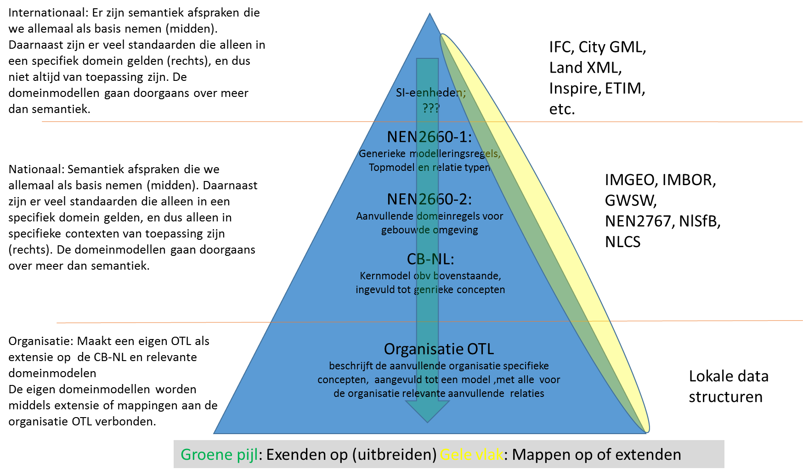

# Inleiding

De bouw moet efficiënter en doelmatiger om de uitdagingen waar de sector voor staat het hoofd te bieden. Digitalisering is één van de belangrijke middelen die hiervoor wordt ingezet. Belangrijk onderdeel van de digitalisering is het uitwisselen en delen van informatie. Om dit te kunnen doen zijn veel standaarden ontwikkeld. Deze zijn echter niet consistent met elkaar. Ook binnen organisaties speelt dit probleem. Informatiebronnen zijn moeilijk te verbinden, onder meer door inconsistente semantiek onderling. Daarom zijn vele organisaties zelf informatiemodellen (OTL, afkorting van object type library) aan het ontwikkelen, om hun gegevensbehoefte te structureren. Deze OTL’s verschillen ook weer van elkaar. De problemen die hieruit volgen kosten veel tijd en capaciteit, hetgeen een flinke barrière vormt voor het bereiken van de beoogde versnelling in de sector.  
Het is belangrijk om te komen tot een gemeenschappelijke taal. CB-NL is hiervoor bedoeld, en kan dienen als kernmodel waar andere standaarden aan kunnen verbinden en waarop OTL’s kunnen aanhaken (‘extenden’). Een gemeenschappelijk kernmodel uniformeert niet ineens de hele wereld, maar legt wel een basis-semantiek aan die het heel veel eenvoudiger maakt om met elkaar te communiceren. In de huidige vorm is de CB-NL hier onvoldoende op toegerust, en wordt dus ook niet als zodanig benut door de sector. 
Door de komst van de NTA8035 en de ontwikkeling van de NEN2660 is er binnen de sector consensus over basisprincipes waaraan voldaan moet worden om informatie deling en uitwisseling beter mogelijk te maken. Verwachting is, dat als de CB-NL wordt aangepast op de uitgangspunten en modelleerregels uit de NEN2660 en de NTA8035, er een krachtig kernmodel ontstaat die deze verbindende rol in de sector wèl kan spelen. Dit doel wordt bereikt door een linked-data-versie van deze richtlijnen door te vertalen in de taxonomie van CB-NL en te publiceren.

Andere standaarden van BIM-loket en van partners kunnen aansluiten op kernmodel van CB-NL. Hierdoor is het in de toekomst mogelijk om een “basis-OTL” te genereren, waarin de landelijke standaarden in 1 structuur aan elkaar gekoppeld zijn. Organisaties die een dergelijke basis-OTL volgen hoeven dus niet meer zelf te modelleren wat er in de sector is afgesproken.

 